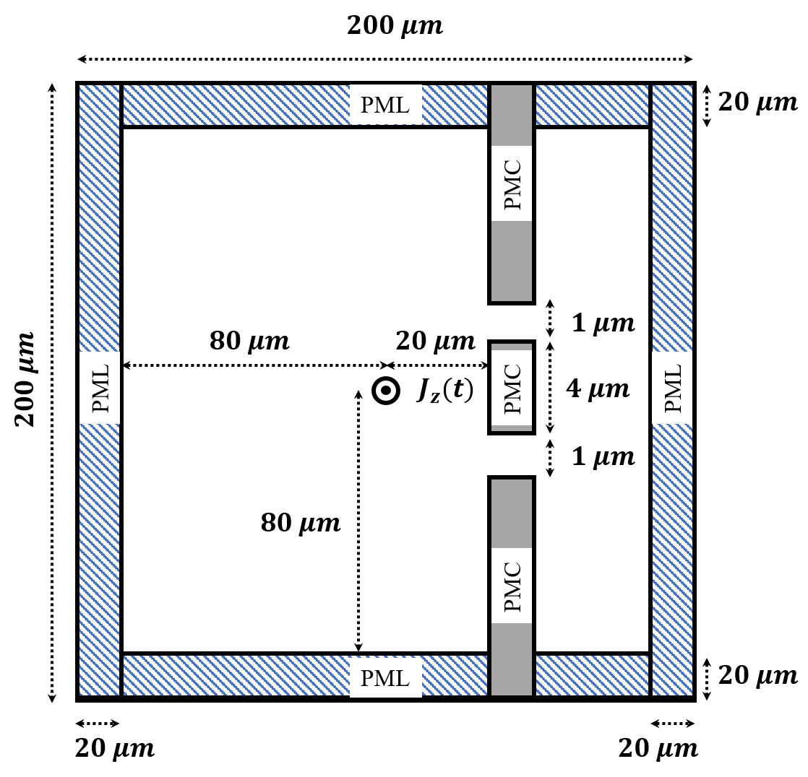
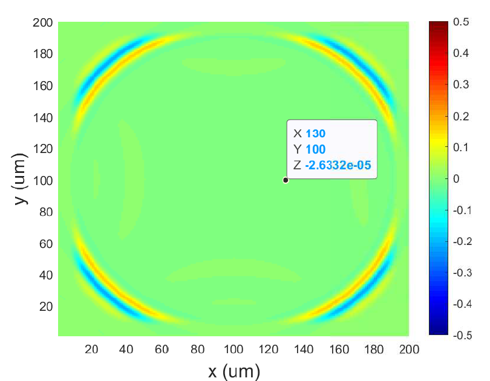
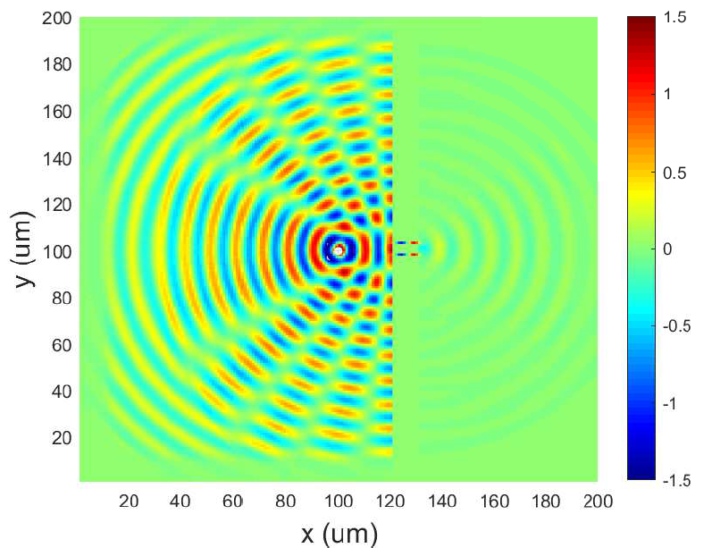

# Computational Electromagnetics: Double-slit Interference Implemented by Finite-Difference Time-Domain
This project is implemented and completed by Yi-Chia Tsai (email: yichiat2@illinois.edu) in the course of ECE540 at University of Illinois: Urbana-Champaign.

ECE540 Project I: Double-slit Interference using FDTD with PML and PMC
 
The Finite-Difference Time-Domain (FDTD) methods have been implemented under the Yee-grid algorithm to study the double-slit interference problems. Perfectly matched layers (PML) have been implemented to simulate infinite space with zero reflection; while the boundary condition between vacuum and the perfect magnetic conductor (PMC) has been carefully maintained so that electromagnetic (EM) waves can propagate through micro-scale slits and reproduce interference patterns. The objective of the project is to understand the fundamental physics and numerical analysis of EM waves.

  
  
  

